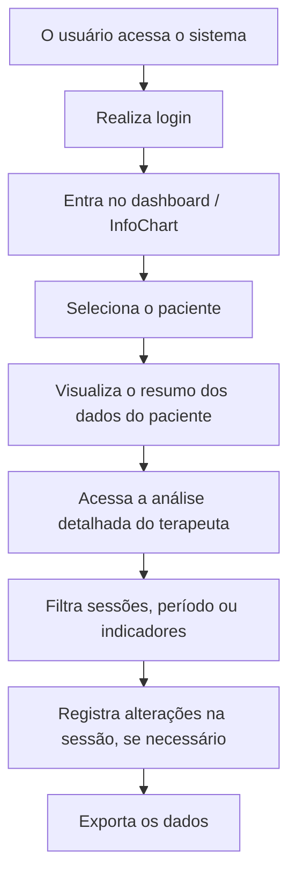

**Engenharia de Software – Católica SC**

---

# Identificação

- **Título do Projeto:**  
  Sistema de Monitoramento e Detecção de Anomalias da Oximetria durante a Fisioterapia Respiratória usando o Jogo Sério Ativo I Blue It.

- **Linha de Projeto (Direction):**  
  IA / IoT / Dados e Jogos Sérios.

- **Autor:**  
  Pedro Henrique Vitoreti

- **Data da Proposta:**  
  1/06/2026

- **Versão:**  
  1.1

---

# 1. Visão do Produto e Impacto (O Problema)
  
Este projeto tem como finalidade aprimorar o jogo sério I Blue It, um sistema biomédico composto por dispositivos, jogos sérios e telemetria, desenvolvido pelo LAboratory for Research on Visual Applications (LARVA) da Universidade do Estado de Santa Catarina (UDESC) com o objetivo de auxiliar na fisioterapia de pacientes com problemas respiratórios. Esse auxílio ocorre por meio de exercícios respiratórios e da análise dos resultados obtidos durante sua execução. Assim, o projeto propõe a aplicação de melhorias tanto no hardware quanto no software do sistema biomédico.

---

## 1.1 Contexto e Problema

A reabilitação respiratória(RR) é um processo fisioterapêutico voltado a pacientes com doenças ou disfunções respiratórias,tendo como finalidade minimizar sintomas, melhorar a capacidade funcional e auxiliar na qualidade de vida dos pacientes.Entretanto frequentemente este processo envolve exercício sistemático, repetitivo e de longo prazo, o que pode torná-los monótono e exaustivo, assim reduzindo a adesão do paciente ao tratamento. Nesse contexto os jogos sérios surgem como uma forma de tornar a reabilitação mais atrativa, utilizando elementos lúdicos, feedback e desafios progressivos para aumentar o engajamento do paciente durante as sessões terapêuticas.[1]

Nesse âmbito o sistema biomédico desenvolvido pela iniciativa de pesquisa do LAboratory for Research on Visual Applications (LARVA) da Universidade do Estado de Santa Catarina(Udesc), chamado I Blue It, foi desenvolvido como um jogo sério ativo voltado à reabilitação respiratória, com o objetivo de auxiliar pacientes durante exercícios respiratórios por meio da gamificação do tratamento.[1]

O jogo utiliza a respiração do paciente como forma de controle, por meio de um do dispositivo de hardware chamado PITACO, um hardware criado baseado no funcionamento de um pneumotacógrafo, que permite capturar sinais relacionados ao fluxo de ar do paciente e disponibilizá-los ao jogo em tempo real.[1]

Abaixo consta um dispositivo pitaco em sua versão mais recente:


[FonteArtigoLeonardoAindaNãoPublicado]

O sistema biomedico atual possui uma serie de jogos e exercicios terapeuticos, dentre eles o que leva o própio nome do sistema, o I Blue It, no qual o paciente interage com o personagem principal, o golfinho Blue, realizando ações respiratórias de inspirar e expirar, que por sua vez movimentam o personagem no ambiente do jogo.[2]


[Figura 2. jogo I Blue It.][2]

O sistema também possui um módulo de análise de dados, ao qual permite médico responsável analisar os dados de calibração e desempenho de seus pacientes,em todos os jogos aplicados, além de possibilitar a exportação dos mesmos em formato csv. 


[Figura 3. iblueit health Infocharts, pagina para processo de envio dos dados sobre os pacientes.][Fonte própia autoria]

Na versão 5.0 descrita por Dias (2024), o I Blue It passa a ser tratado como uma plataforma multimodal voltada ao Flow Psicofisiológico, conceito que busca ajustar a dificuldade dos exercícios considerando tanto o desempenho do paciente no jogo quanto sinais associados ao seu estado físico e psíquico. Para isso, o sistema utiliza o módulo DeepDDA, um agente de inteligencia artificial baseado em aprendizado por reforço profundo, capaz de adaptar dinamicamente os desafios do exergame a partir dos dados coletados durante a sessão.
Nesse modelo, dispositivos como o PITACO continuam fornecendo dados respiratórios relacionados à execução dos exercícios, enquanto sensores fisiológicos, como o oxímetro, podem fornecer informações complementares sobre a condição do paciente, especialmente para fins de monitoramento e segurança do paciente, tendo como fim para tais dados o ajuste da sessão a situação fisiologica do paciente, pondendo levar a diminuição da dificuldade ou em casos de oxigenação baixissima, pausa ou encerramento da sessão. [2]

Entretanto, a tese de Dias (2024) apresenta o uso da SpO₂ no I Blue It 5.0 no contexto de uma prova de conceito do Flow Psicofisiológico e do módulo DeepDDA. Embora essa prova de conceito demonstre a viabilidade técnica do uso da oximetria para apoiar decisões de segurança e adaptação dinâmica, ela não caracteriza, por si só, uma integração operacional definitiva do oxímetro ao ecossistema. Assim, ainda permanecem pontos a serem especificados e consolidados, como hardware, firmware, comunicação, confiabilidade da leitura, tratamento de erros, persistência dos dados e segurança da transmissão.

Com base nessa estrutura, a melhoria proposta neste RFC concentra-se na integração do módulo de oximetria ao dispositivo PITACO, permitindo que dados de saturação de oxigênio sejam coletados, transmitidos, armazenados e disponibilizados ao sistema de forma segura. A proposta não busca alterar a mecânica principal do jogo, mas aprimorar a camada de monitoramento fisiológico, ampliando a capacidade do I Blue It de acompanhar sinais relevantes durante a execução dos exercícios respiratórios, trazendo mais segurança para os pacientes.

---

## 1.2 Origem da Demanda e Evidências

A concepção do tema desta pesquisa surge no Laboratory for Research on Visual Applications (LARVA) da UDESC em colaboração com profissionais da área de fisioterapia respiratória e áreas correlatas, com o objetivo de atender a problemáticas reais do domínio clínico. Sendo assim desde o princípio o sistema tem como foco atender as necessidades de ferramentas que auxiliem no processo de atendimento médico e tratamento de pacientes com problemas respiratórios.[1]

Os pimeiros resultados surgiram em 2018, a pesquisa sendo feita com a particiação de 80 profissionais da saúde (fisioterapeutas, médicos pneumologistas, fisioterapeutas respiratórios, neurologistas) os quais atuavam com a finalidade de garantir a efetividade da ferramenta ao longo do próprio desenvolvimento, e que ao final o avaliaram, obtendo um resultado muito satisfatório, uma nota 4.1 de 5, demonstrando grande satisfação por parte dos envolvidos. [1]

Desde sua fase inicial até agora houveram diversas melhorias em cada uma das versões, segue um histórico de versões de maneira resumida:

- versão 01 - I Blue It / Pitaco (2018):
  - Criação do dispositivo Pitaco (responsável por medir fluxo de ar) e do jogo "Blue"
- versão 02 - I Blue It / ManoBD (2019):
  - Adição de minijogos do Copo d’água e Bolo de Aniversário e concepção do dispositivo MonoDB (responsável por medir a pressão do ar)
- versão 03 - I Blue It / Health InfoCharts (2020):
  - Adição de módulo de análise clínica do paciente (Histórico e resultados dos jogos mostrados e armazenados)
- versão 04 - I Blue It / Multimodal (2020):
  - Incorporação de arquitetura Multimodal 123-SGR o que permitiu a incorporação de dispositivos distintos como Pitaco e ManoBD
- versão 04.5 - I Blue It / Multimodal redesign (2023):
  - Redesign para a incorporação de IA ao projeto
- versão 05 - I Blue It / Flow Psicofisiológico (2024):
  - Incorporação de Flow Psicofisiológico (busca equilibrar a parte motivadora psíquica, com a parte fisiológica do paciente) e IA ao projeto com o fim de controlar o Flow Psicofisiológico

Apesar dos avanços já alcançados no ecossistema I Blue It, ainda existem melhorias a serem desenvolvidas no sistema biomédico, especialmente quanto à integração de novos recursos de monitoramento fisiológico e ao aprimoramento de seus componentes de hardware e software. Nesse contexto, por meio de uma bolsa de Iniciação Científica vinculada à UDESC, este projeto tem como proposta dar continuidade ao desenvolvimento da ferramenta, realizando a integração de um oxímetro ao dispositivo PITACO e promovendo ajustes complementares no sistema.

Assim, o projeto de melhoria parte da continuidade de um trabalho técnico-acadêmico já consolidado, buscando tratar lacunas identificadas e contribuir para o aprimoramento de uma solução voltada ao apoio da comunidade fisioterapêutica na reabilitação de pacientes com problemas respiratórios.

## 1.3 Análise de Soluções Existentes (Benchmark)

**BubbleBreather**  
Uma pequena coleção de jogos/atividades para exercícios respiratórios focados apenas na recuperação de pneumonia. Pode ser acessado pelo GitHub público e possui uma demo web ativa, por mais que não haja updates desde 2020. Possui um escopo mais estreito sendo jogos feitos no próprio browser, depende de microfone, com foco em exercícios específicos e não apresenta uma camada clínica robusta, comparável a dashboard terapêutico ou equipamentos IoT terapêuticos multimodalidade com sensores dedicados.


link do repositório : https://github.com/hcilab/BubbleBreather?tab=readme-ov-file

público-alvo : pessoas em recuperação de pneumonia

**PlayPhysio**

Uma iniciativa originada pela demanda de um pai cuja filha possui fibrose cística e necessitava realizar fisioterapia, porém o tratamento não era engajador o que dificultava a participação e o interesse da criança. Com isso em mente, decidiu-se criar uma plataforma gamificada para que sua filha pudesse realizar seus exercícios de maneira mais lúdica. Para fazer isso a plataforma acopla um equipamento IoT chamado PhysioPal ao equipamento terapêutico que ao se conectar via bluetooth no aparelho celular, registrará a pontuação no app. Não parece apresentar publicamente um ecossistema clínico tão robusto quanto o I Blue It, contendo dashboard terapêutico ou equipamentos IoT com sensores dedicados acoplados diretamente ao sistema, porém contém feedback em tempo real, e fornecimento detalhado de dados.


links do projeto:
- https://www.jbs.cam.ac.uk/ventures/playphysio/
- https://play.physio/

público-alvo : pessoas com problemas respiratórios (com foco em crianças)

**ACPlus Respiratory Assessment + OmniFlow**

A empresa Accelerated Care Plus produz duas soluções no ramo de terapia respiratória sendo eles o ACPlus Respiratory Assessment uma solução voltada a ajudar na etapa de diagnóstico e decisão clínica de disfunções pulmonares, onde por meio de um dispositivo que captura os dados da respiração do paciente e os transmite a um iPad por meio do bluetooth, que por sua vez retorna em formato de prontuário com a documentação clínica necessária aos profissionais da saúde. A outra chamado OmniFlow, tem como foco o tratamento gamificado através de terapias pulmonares por meio de experiências interativas/gamificadas, onde o paciente realiza o tratamento através de um dispositivo espirômetro bluetooth que capta seus dados, que são utilizados tanto nos exercícios, quanto posteriormente permite a análise por um profissional de saúde. Entre suas limitações podemos destacar a exclusividade de implantação, pois atualmente os sistemas são voltados às regulamentações e normativas do seu país de origem Estados Unidos, o que limita a sua atuação preferencialmente apenas ao mercado estadunidense.

- OmniFlow
- 

links dos produtos:
- https://acplus.com/acplus-respiratory-assessment-lp/
- https://acplus.com/technology/omniflow/
- https://acplus.com/blog/success-stories/omniflow-in-action-restoring-speech-confidence-and-connection/
  
público-alvo : pessoas com problemas respiratórios de modo amplo

---

### Comparação

| Solução | Pontos Fortes | Limitações |
|---|---|---|
| BubbleBreather |Permite a utilização do sistema em diversos ambientes (por ser em browser)|Não possui módulo clínico especializado|
| PlayPhysio |Permite tratamento gamificado, com especialização em exercícios lúdicos com foco infantojuvenil| Ecossistema clínico mais simplificado|
| OmniFlow |Permite o tratamento gamificado, e dados clínicos detalhados|Especificidade do sistema ao ambiente estadunidense|

---

### Diferencial do Projeto

Analisando os projetos elencados, podemos concluir que no campo das soluções respiratórias gamificadas elencadas se distribuem em três grandes grupos. O primeiro é o de soluções leves e acessíveis, como o BubbleBreather, que prioriza a simplicidade tecnológica e acesso rápido. O segundo é o das soluções orientadas ao engajamento familiar e à adesão de maneira lúdica, como o PlayPhysio. O terceiro é o das soluções com maior maturidade clínica e comercial, como o ACPlus Respiratory Assessment e o OmniFlow, fortemente ligado à atuação completa desde análise de desempenho do paciente em resposta ao tratamento, até ao tratamento gamificado e lúdico.

Porém podemos perceber que enquanto os dois primeiros concorrentes apresentem pontos fortes específicos e distintos, e que não cobrem todo o escopo já tratado pelo software I Blue It, o terceiro apresenta uma solução completa e semelhante ao software I Blue It, porém trazendo consigo uma diferença crucial, a especificidade ao ambiente estadunidense, o que impossibilita sua implementação de maneira simplificada em outros ambientes e sistemas.

Dado isto percebemos a lacuna nítida de uma ferramenta completa ao ambiente fisioterápico brasileiro, que abranja de maneira relevante tanto a gamificação dos exercícios fisioterápicos voltados à reabilitação respiratória, como a análise dos dados de desempenho do paciente, que é justamente a lacuna técnica que o I Blue It cobre.  

---

## 1.4 Público-Alvo

O sistema terá dois públicos principais:

Paciente em reabilitação respiratória: crianças e adultos que realizam exercícios terapêuticos respiratórios com acompanhamento profissional.

Profissional de saúde: fisioterapeutas respiratórios, fisioterapeutas clínicos, pneumologistas e demais especialistas que acompanham a sessão dos pacientes, definem parâmetros terapêuticos e analisam os resultados.

---

## 1.5 Objetivos do Projeto

### Objetivo Geral

O projeto se propõe a adicionar funções e modulos, tanto ao hardware como ao software, de modo a cobrir primariamente a segurança e monitoramento da saturação sanguinea do paciente em tempo de execução das sessões, e sua coleta e processamento dos dados oriundos da oximetria, para auxiliar os profissionais responsáveis na tomada de decisões .

Pretende-se assim adicionar um novo sensor de oximetria(spo2) ao aparelho de catação de dados existente PITACO, ao qual seram utilizado tais dados de saturação sanguínea para a criação de um modulo, responsável pelo monitoramento e seguraça do paciente durante a sessão.

Tais mudanças acarretam em alterações imediatas no sistema biomédico atual, como a adição ao dashboard clínico do dado de saturação sanguinea do paciente, com a finalidade de fornecer ao profissional da saúde responsável mais um dado em sua tomada decisão.Também será necessario alterar a Ia de monitoramento e detecção de anomalias, responsável pela avaliação do estado do paciente em tempo de execução, passando agr a se utilizar de um novo parametro o biosinal de saturação sanguínea em seu processo, e retornando , recomendações de pausa ou interrupção imediata.  

---

### Objetivos Específicos

Tendo em vista a problemática apresentada, este projeto tem como fim sanar as lacunas identificadas com fim de entregar ao final, um sistema biomédico mais completo. Baseando-se nisso segue abaixo os objetivos a serem tratados:

- Integrar o hardware existente do PITACO ao sensor de Spo2 para monitoramento fisiológico complementar, atrávez da saturação sanguinea, e se possivel o batimento cardiáco.
- Atualizar o módulo de ajuste dinâmico por inteligência artificial responsável pela dificuldade, para suportar o novo parâmetro de Saturação Sanguínea.
- Atualizar o dashboard clínico para exibir e correlacionar dados respiratórios, da oxigenação e de desempenho nos jogos e sessões.

---

## 1.6 Métricas de Sucesso (KPIs)

As Metricas de sucesso estipuladas são:

- Registro correto de sessões com dados respiratórios do novo componente SpO2 mantendo a velocidade e metricas do sistema atual.
- Acurácia da IA de monitoramento fisiológico superior a 85%.
- Ajuste dinâmico com delay de até 800ms na dificuldade durante a sessão, ao utilizar a IA de monitoramento fisiológico .
- Tempo de resposta do sistema inferior a 800 ms para feedback em gameplay.
- Adição dos dados obtidos pelo Sp02 ao dashboard apresentando todos os dados já existente e novos pertinentes, mantendo o tempo de resposta atual.
- Acuracia dos calculos do sensor Spo2 sobre saturação sanguínea igualada a equipamentos homologados.

---

# 2. Engenharia de Requisitos

Este segmento define oque a melhoria realizará para atender as novas necessidades de monitoramento e segurança do paciente, sobre o sistema biomédico I Blue It.Nesse sentido os dados atualmente fornecidos, são insuficientes para a utilização do módulo de IA(inteligência artificial), de modo a monitorar a segurança biofisiologica do paciente e garantilá durante as sessões.

Sendo assim a melhoria abrange duas frentes, a primeira, adicionar a coleta de tais dados, sendo feita por meio de um incremento do sensor spo2(sensor de oximetria) ao dispositivo PITACO, e a segunda sendo os ajustes necessarios no sistema biomédico atual para suportar tais mudanças, ajustes estes como, adicionar parâmetros de oximetria a IA de flowpsicologico, assim ajustando ou interrompendo as sessões em casos identificados como  anomalos ou de iminente risco fisiológico ao paciente, e aprimoração com a adição dos novos dados aos dashboards clínicos, utilizados pela equipe médica na tomada de decisão.Assim buscamos em ultima instância garantir que a sessões sejam realizadas na dificuldade adequada ao paciente, por meio do monitoramento contínuo e em casos anomâlos parando a mesma.

O projeto tem como premisa que o software I Blue It já possui uma  base funcional composta por jogo sério, dispositivos IoT para captura respiratória, armazenamento de dados, calibração por iteligencia artificial e acompanhamento por profissional.Sendo assim os requisitos estipulados abaixo descrevem as funcionalidades necessarios para a integração do novo módulo proposto, saturação sanguinea ao sistema existente. 

---

## 2.1 Personas
### Persona 1 — Ana Clara, paciente em reabilitação respiratória

**Contexto:**  
Ana Clara uma criança de 12 anos realiza sessões de fisioterapia respiratória, por possuir problemas respiratorios. Ela apresentava dificuldade em manter a constância dos exercícios, considerando o tratamento repetitivo e cansativo. Durante as sessões, passou a utilizar o jogo I Blue It com acompanhamento de um fisioterapeuta, oque apresetou repectiva melhora ao quadro.

**Objetivos:**  
- Proporsionar os exercícios respiratórios de uma forma mais lúdica e motivadora.
- Receber feedback visual durante a sessão de tratamento.
- Conseguir completar os niveis e desafios do jogo sem sentir excessivamente desconfortavel.
- Evoluir gradualmente a dificuldade, conforme sua melhora na capacidade respiratória.

**Principais dificuldades:**  
- Perde a motivação quando os exercícios são repetitivos.
- Em exercicios longos pode apresentar fadiga ou desconforto.
- Não pussue sensibilidade necessario para perceber quando está realizando esforço excessivo.
- Dependente da orientação de um profissional para realizar adequada dos exercícios propostos.

---

### Persona 2 — Dr. Marcos, fisioterapeuta respiratório

**Contexto:**  
Dr. Marcos atua em uma clínica voltada ao tatamento fisioterapico, na area respiratória onde acompanha pacientes com diferentes quadros clínicos. Ele se faz uso de ferramentas de apoio em vista de tornar os seus tratamentos mais motivador e ludico, assim o auxiliando na apicação do tratamento, acompanhamento e evolução dos pacientes ao longo das sessões.

**Objetivos:**  
- Configurar parâmetros para exercício seguindo o perfil clínico do paciente.
- Acompanhar os dados respiratórios e fisiológicos em tempo de execução da sessão.
- Visualizar histórico do paciente analisando seu desempenho e evolução.
- Identificar sinais de alerta tais como queda de saturação, fadiga ou baixo resultado ao exercício.
- Utilizar os dados obtidos e processados pelo sistema como apoio na tomada de decisão.

**Principais dificuldades:**  
- Necessita acompanhar simultaneamente a execução respiratória do paciente suas condições fisiológica e seu desempenho no jogo.
- Necessita de dados objetivamente organizados e claros para sua avaliação de evolução e tomada de decisão.
- Precisa evitar que o paciente seja submetido a esforços inadequados.
- Precisa ajustar a dificuldade do exercício de maneira a não interroper a sessão.

---

## 2.2 Casos de Uso Principais

Considerando o estado atual em que o software se encontra, com suas inumeras funcionalidades e aprimoramentos de cada versão, foram abstraidos as suas principais funções e caracteristicas para a criação de dois fluxos, consistindo em primasia uma abstração geral sobre o modelo atual do sistema I Blue It, e posteriormente uma derivação para fins comparativos, contendo este as princiapis mudanças e impactos no fluxo que a melhoria se propẽm a realizar.

Para o atual estado do software foram elencado as seguintes funcionalidades:

### UC01 — Cadastrar/Selecionar Paciente

**Objetivo:** Identificar paciente que realizará a sessão terapêutica.

**Descrição:**
O sistema permite que o profissional de saúde cadastre o paciente caso seje novo, ou permite a seleção de um paciente previamente cadastrado.Essa funcionalidade tem como fim associar os pacientes as sessões do jogo e seus dados taus como calibrações, dados respiratórios, histórico e resultados.

---

### UC02 — Capturar dados respiratórios (via PITACO)

**Objetivo:** Receber os dados fisiológicos necessarios para a realização do jogo.

**Descrição:**
O sistema permite que o paciente por meio do dispositivo PITACO tenha seus dados fisiologicos estipulados e monitorados.Essa funcionalidade tem como fim capturar os dados necessarios para a realização de todas as operações do sistema.

---

### UC03 — Calibrar Respiração

**Objetivo:** Calibrar o sistema baseando-se na fisiológia do paciente.

**Descrição:**
O sistema permite que o paciente adjunto ao profissional de saúde calibrem o preparem o ambiente para a realização dos exercicios.Essa funcionalidade tem como objetivo adequar e preparar o software para realizar o exercicio ao paciente.

---

### UC04 — Configurar Sessão Terapêutica

**Objetivo:** Preparar a sessão com o exercicio  trapeutico adequado ao paciente.

**Descrição:**
O sistema permite que o profissional de saúde configure a sessão terapêutica a ser executada.Essa configuração se caracterizando por poder envolver desde a preparação do paciente, escolha do modo de jogo até a definição de parâmetros para a realização da atividade.

---

### UC05 — Executar Game Plataforma

**Objetivo:** Realizar o exercicio terapeutico com o jogo de plataforma

**Descrição:**
O sistema permite que o paciente ralize a sessão de exercicio teraupeutico do game de plataforma, no qual utiliza-se de sua respiração no instrumento PITACO para controlar um personagem verticalmente assim o fazendo desviar de obstaculos que aparecem para completar o nivel.Deste modo buscando exercitar o paciente de maneira lúdica. 

---

### UC06 — Executar Minigame

**Objetivo:** Realizar o exercicio terapeutico com os minijogos existentes 

**Descrição:**
O sistema permite que o paciente ralize a sessão de exercicio teraupeutico em um dos minigames existentes, no qual utiliza-se de sua respiração no instrumento PITACO para controlar as ações de cada nivel.Deste modo buscando exercitar o paciente de maneira lúdica. 

---

### UC07 — Personalizar Fases ou Níveis

**Objetivo:** Personalizar as fases para adeuquar ao perfil,fisiologia e evolução do paciente

**Descrição:**
O sistema permite que o profissional da saúde personalize as fazes para conter o tamanho e desafios adequados ao caso clinico do paciente.Esta funcionalidade permite a alteração dos niveis, fases e desafios do jogo de plataforma.

---

### UC08 — Acompanhar Sessão

**Objetivo:** Permitir supervisão por parte do profissional de saúde sobre a atividade terapêutica.

**Descrição:**
O sistema permite que o profissional de saúde acompanhe a realização da sessão terapêutica.Assim posibilitando observar o andamento e desempenho da execução do paciente, permitindo a tomadada de decisões durante ou breve após a sessão 

---

## UC09 — Ajustar Dificuldade Dinamicamente

**Objetivo:** Adequar a dificuldade do jogo à capacidade e ao desempenho do paciente.

**Descrição:**
O sistema ajusta a dificuldade da atividade em tempo de execução do exercicio terapeutico se adequando ao desempenho do paciente.Esse ajuste se caracteriza por envolver mudanças em parâmetros do jogo tais como obstaculos, velocidade, alvos ou nivel de desafio.

---

### UC10 — Registrar Histórico de Sessão

**Objetivo:** Armazenar dados da sessão fisioterapica para avaliação futura.

**Descrição:**
O sistema registra os dados gerados durante a sessão, tais como calibração, desempenho e dados respiratórios capturados.Esses dados constituindo o historico do paicente pedendo ser consultado posterioemente pelo profissional da saúde.

---

### UC11 — Consultar Dados / Relatórios

**Objetivo:** Disponibilizar informações obtidas anteroriormente para acompanhamento avanço clínico.

**Descrição:**
O sistema permite que o profissional da saúde consulte os dados e relatórios obtidos das sessões já realizadas.Essa funcionalidade auxilia o profissional na analise  da evolução do paicente e tomada de decisões eventuais envolvendo o tratamento. 

---

### UC12 — Interromper Sessão

**Objetivo:** Garantir soberania do profissional da saúde sobre da sessão terapêutica.

**Descrição:**
O sistema permite que o profissional da saúde interrompa a sessão quando achar necessário. Essa ocorrendo por decisão clínica esclusiva do proficional da saúde, baseada em sua experiencia e supervisão sobre o paciente em casos onde o paciente possa estar demosntrando desconforto, dificuldade na execução ou necessidade do encerramento da sessão de terapia.

---

Logo abaixo consta o diagrama de tais casos de uso e suas respectivas correlações: 


Já para a versão melhorada foram acresentados alguns casos, referentes ao novo modulo contendo o spo2, como pode-se ver abaixo:

### UC14 — Capturar Dados Respiratórios e SpO2 via PITACO Ampliado

**Objetivo:** Ampliar a coleta de dados fisiologicos do paciente, integrando no mesmo dispositivo PITACO captura de informações respiratórias e de oxigenação sanguínea.

**Descrição:**
O sistema permite capturar dados fisiologicos, por meio do PITACO ampliado, tanto os já utilizados dados respiratórios do paciente quanto os dados de saturação de oxigênio. Isso sendo feito por meio da adição do módulo Spo2 ao corpo do PITACO, com dispositivo passando a fornecer mais informações fisiológicas durante a sessão terapêutica.

---

### UC15 — Validar, Filtrar e Transformar Sinais Brutos

**Objetivo:** Garantir que os dados respiratórios capituados pelo SpO2 sejam consistentes, confiáveis e adequados para análise.

**Descrição:**
O sistema realiza a validação e tranformação dos dados brutos obtidos pelo Spo2 para dados como saturação sanguinea, frequência cardiaca e posição adequada do dispositivo, com a finalidade de fornecer tais dados processados para as outra partes interconectadas do sistema.Essa etapa permite validar se os dado estão sendo caputurados de maneira adequada e que estejam sendo retornados também de maneira adequada, para as demais partes.

---

### UC16 — Registrar Dados de Oxigenação

**Objetivo:** Armazenar os dados do Spo2 obtidos durante a sessão para fornecelos no acompanhamento clínico e análise posteriores.

**Descrição:**
O sistema registra os dados de oxigenação sanguinea obtidos durante a sessão pelo modulo Spo2.Esses dados passam a compor adjunto aos já existenteo o histórico do paciente, permitindo que o profissional da saúde em consultas posteriores tenha acesso a estas informações.

---

### UC17 — Emitir Alerta de Segurança

**Objetivo:** Alerta o profissional da saúde sobre possíveis riscos fisiológicos occoridos em tempo de execução da sessão terapêutica.

**Descrição:**
O sistema emite um alerta de segurança ao profissional da saúde quando indentifica que os sinais disiologicos do paciente indicam condições de risco ao mesmo, isso em durante a sessão terapêutica. Esses alertas podem estar relacionados a sinais incopativeis com a execução do exercicio como exesso ou falta de oxigenação , ou ainda a casos onde o dispositivo pode estar apresentando falahas na leitura.

---

### UC18 — Pausar/Interromper Sessão por Risco Fisiológico

**Objetivo:** Proteger o paciente durante a sessão, interompendo a atividade que desmontre situações de risco.

**Descrição:**
O sistema interrompe sessçoes em que forem identificados padrões anomalos ou de alto risco fisiologico ao paciente.Essa funcionalidade atua como medida de precaução e segurança, permitindo a pausa momentânea ou suspensão caso os sinais indiquem uma condição inadequada durante o exercicio.

****

Abaixo pode se ver o fluxo com a melhoria proposta:


---

## 2.3 Requisitos Funcionais (RF)

  Em vista dos trabalhos já realizados e documentados das versões passadas do software I Blue It, está proposta de melhoria não se atem aos requisitos funcionais da versão atual do software, e sim, apenas aos pertinentes a sua melhoria, nisto consistindo na integração do módulo de monitoramento de SpO₂ para apoiar a segurança fisiológica durante as sessões de reabilitação respiratória, cujo o qual estão presentes logo abaixo.
  Outro adendo necessario, para diferenciar o local onde a melhoria será aplicada, do software já existente, foi nomeado a melhoria como modulo Spo2 sendo este o modulo responsável peloa captação, validação, correção e calculo de oxigenação e estipulação do pulso cardiaco do paciente, e o sistema já existente sendo referido como sistema I Blue It, assim mostrando quais partes terão de fazer quais tarefas, e suas respectivas interrações e responsabilidades.  

| ID | Requisito Funcional |
|----|---------------------|
| RF01 | O sistema deve permitir que o sensor Spo2 seja conectado ao sistema, sem interromper ou comprometer funcionalidades existentes. |
| RF02 | O sistema deve permitir que o sensor Spo2 envie dados durante a sessão a todos os modulos pertinentes do software I Blue It. |
| RF03 | O sistema deve permitir que o sensor Spo2 envie dados de frequência cardíaca, quando disponíveis. |
| RF04 | O sistema deve permitir que o software I Blue It receba dados do modulo Spo2 em tempo real. |
| RF05 | O sistema deve permitir que o modulo Spo2 valide o contato do sensor ao paciente. |
| RF06 | O sistema deve permitir que o modulo Spo2 valide a qualidade do sinal recebido. |
| RF07 | O sistema deve permitir que o modulo Spo2 ignore leituras inválidas de oxigenação. |
| RF08 | O sistema deve permitir que o sistema monitore a oxigenação do paciente durante a execução do jogo. |
| RF09 | O sistema deve permitir que o terapeuta configure o limite mínimo de oxigenação. |
| RF10 | O sistema deve permitir que o modulo Sp02 compare a oxigenação obtida, com o limite definido pelo terapeuta. |
| RF11 | O sistema deve permitir que o modulo Sp02 alerte o software I Blue It quando a oxigenação estiver abaixo do limite definido. |
| RF12 | O sistema deve permitir que o modulo Spo2 emita alerta quando o sensor estiver desconectado. |
| RF13 | O sistema deve permitir que o modulo Spo2 emita alerta quando o sensor estiver mal posicionado, pausando a sessão. |
| RF14 | O sistema deve permitir que o modulo Spo2 registre a série temporal de oxigenação da sessão no software I Blue It. |
| RF15 | O sistema deve permitir que o modulo Spo2 registre o menor valor de oxigenação da sessão. |
| RF16 | O sistema deve permitir que o modulo Spo2 registre eventos de queda de Spo₂. |
| RF17 | O sistema deve permitir que o registre eventos de falha ou perda de sinal do modulo Spo2. |
| RF18 | O sistema deve permitir que o modulo Spo2 recomende pausa ao terapeuta quando houver risco fisiológico ao paciente. |
| RF19 | O sistema deve permitir que o modulo Spo2 pause automaticamente a sessão no software I Blue It caso a oxigenação esteja em condição crítica. |
| RF20 | O sistema deve permitir que o terapeuta autorize a retomada da sessão após normalização da Spo2. |
| RF21 | O sistema deve permitir que o software I Blue It apresente o estado do monitoramento fisiológico na interface. |
| RF22 | O sistema deve permitir que o terapeuta visualize os dados do modulo Spo2 durante e após a sessão. |
| RF23 | O sistema deve permitir que o modulo Spo2 gere um resumo fisiológico da sessão para ser apresentado no software I Blue It. |
| RF24 | O sistema deve permitir a associação dos dados obtidos pelo modulo Spo2 aos dados já obtidos pelo software I Blue It durante a sessão terapeutica . |
| RF25 | O sistema deve permitir que o terapeuta consulte os registros fisiológicos de sessões anteriores. |
| RF26 | O sistema deve permitir que em caso de eventuais pausas os dados fisiologicos até então captados não sejam perdidos e possam ser recuperados . |

---

## 2.4 Requisitos Não Funcionais (RNF)]

Os requisitos não funcionais descritos nesta seção seguem o mesmo principio descrito nos Funcionais onde o foco para elencalos foi ter em mente a solução e oque ela alterará no modelo atual, porém agora estipulando métricas qualitativas de desempenho, segurança, confiabilidade, usabilidade, compatibilidade e manutenção que devem ser atendidas pela melhoria proposta.

| ID | Categoria | Requisito Não Funcional |
|----|-----------|--------------------------|
| RNF01 | Compatibilidade | O módulo Spo2 deve ser integrado ao software I Blue It sem comprometer as funcionalidades já existentes no software ou hardware. |
| RNF02 | Modularidade | O módulo Spo2 deve ser desenvolvido de forma independente, permitindo sua manutenção sem necessidade de alterar partes centrais do software I Blue It. |
| RNF03 | Interoperabilidade | O módulo Spo2 deve se comunicar com o software I Blue It por meio de um formato de dados definido e compreensível pelos dois componentes. |
| RNF04 | Desempenho | O módulo Spo2 deve atualizar os dados de oxigenação e frequência cardíaca em tempo compatível com o acompanhamento da sessão terapêutica. |
| RNF05 | Tempo de resposta | O módulo Spo2 deve emitir alertas de risco fisiológico em tempo suficiente para que o terapeuta possa intervir durante a sessão. |
| RNF06 | Confiabilidade | O módulo Spo2 deve evitar o uso de leituras inválidas, instáveis ou incompatíveis com um sinal fisiológico confiável. |
| RNF07 | Robustez | A perda de conexão com o sensor Spo2 não deve causar travamento ou encerramento inesperado do software I Blue It, mas deve gerar alertas e avisos. |
| RNF08 | Segurança fisiológica | O módulo Spo2 deve priorizar a segurança do paciente em relação à continuidade da sessão no jogo. |
| RNF09 | Segurança operacional | O software I Blue It deve ser capaz de interromper, pausar ou sinalizar risco quando o módulo Spo2 indicar condição fisiológica crítica. |
| RNF10 | Usabilidade | O estado do módulo Spo2 deve ser apresentado de forma clara ao terapeuta, indicando se o sensor está conectado, desconectado, válido, inválido ou em alerta. |
| RNF11 | Clareza de interface | Os alertas relacionados à oxigenação, perda de sinal ou mau posicionamento do sensor devem ser compreensíveis para o terapeuta durante a sessão. |
| RNF12 | Rastreabilidade | Os dados fisiológicos registrados pelo módulo Spo2 devem estar associados à sessão, ao paciente e ao momento em que foram coletados. |
| RNF13 | Integridade dos dados | Os dados de oxigenação, frequência cardíaca e eventos de alerta devem ser armazenados sem sobrescrever ou corromper os dados já registrados pelo software I Blue It. |
| RNF14 | Persistência | Os registros fisiológicos da sessão devem permanecer disponíveis para consulta após o encerramento do jogo. |
| RNF15 | Privacidade | Os dados fisiológicos do paciente devem ser tratados como informações sensíveis e não devem ser expostos indevidamente. |
| RNF16 | Manutenibilidade | O código do módulo Spo2 deve ser organizado de forma a facilitar ajustes, correções e futuras expansões. |
| RNF17 | Testabilidade | O módulo Spo2 deve permitir testes com dados simulados, possibilitando verificar conexão, validação de sinal, alertas e registro de dados sem depender exclusivamente do sensor físico. |
| RNF18 | Extensibilidade | A estrutura do módulo Spo2 deve tem em mente a modularidade com o fim de permitir futura adaptação para outros sensores fisiológicos, caso necessário. |
| RNF19 | Consistência | As nomenclaturas, unidades e formas de apresentação dos dados fisiológicos devem ser consistentes em todo o sistema. |
| RNF20 | Recuperação de falhas | O módulo Spo2 deve permitir a retomada do monitoramento após falha temporária de conexão ou reposicionamento do sensor. |
| RNF21 | Compatibilidade | O módulo Spo2 deve ser codificado em linguagens e tecnologias já presentes no software |

---

## 2.5 Regras de Negócio

As regras de negócios aqui presentes foram elencadas com memo ímpito de mostrar apenas a melhoria, tratando tanto o modulo da melhoria(módulo Spo2), quanto o sistema I Blue It já existente, apenas como um unico sistema unificado, porém abrangendo apenas os apectos presentes no I Blue IT que compétem a ser tratados na melhoria.Assim não remodelamos as regras de negócios do sistema biomédico existente.

- Apenas o terapeuta pode definir o limite mínimo de oxigenação.
- O terapeuta responsável pode pausar ou parar a sessão a qualquer momento.
- O terapeuta responsável pode adaptar a sessão comforme sua análise clínica.
- Em situações fisiológicas críticas, a segurança do paciente deve prevalecer em relação a continuidade da sessão em andamento.
- Uma sessão fisioterapica apenas podem ocorrer se os equipamentos de medição estiverem aptos, posicionados e captando os sinais vitais do paciente corretamente.
- Durante uma sessão caso ocorra problemas de medições devido a problemas no equipamento, mal posicionamento e ou no processamento dos dados o sistema deve pausar a sessão, e notificar o usuario (paciente e medico), 
- Durante as sessões o sistema deve avisar o medico de anomalias nos biosinais.
- Em casos de parada da sessão o sistema deve manter os dados já obtidos da sessão, e possibilitar tanto a retomada do exercicio do estado atual do exercicio, ou eventual encerramento da sessão.  
- Apenas a equipe médica e o paciente, devem ter acesso aos dados fisiologicos do paciente.
- O sistema deve disponibilizar os dados captadas do paciente há equipe medica.
- A sessão pausada só pode ser retomada após autorização do terapeuta.
- A sessão deve ser pausada caso o sistema identifique risco fisiológico ao paciente.
- A leitura do modulo Spo2 só deve ser considerada válida se houver contato adequado do sensor com o paciente.
- A oxigenação deve ser calculada somente com dados válidos.
- Em caso de leituras inválidas ou instáveis, não devem ser utilizadas tais medições para o calculo da oxigenação do paciente.
- O limite mínimo de oxigenação definido pelo terapeuta deve ser usado como referência para classificar a condição fisiológica do paciente durante a sessão.
- O limite mínimo de oxigenação estipulado pelo terapeuta deve ser usado como referência para analisar a condição fisiológica do paciente durante a sessão.
- Os dados do novo modulo Sp02 não devem substituir os dados já presentes no ecosistema I Blue It.
- Os dados do novo modulo Sp02 devem ser integrados aos dados já presentes no ecosistema I Blue It.
- Eventos de alerta tais como queda de oxigenação, perda de sinal e ou pausa da sessão devem ser registrados no histórico da sessão.
- A frequência cardíaca deve ser registrada sempre que possivel pelo modulo Sp02.
- Em casos de muito breve ausência de sinal fisiológico não devem ser interpretadas automaticamente como condições crítica do paciente.
- O terapeuta responsável deve ter acesso aos registros fisiológicos da sessão após seu encerramento.

---

## 2.6 Fora do Escopo

Aqui constam alguns pontos que está proposta não realizará, apenas ilustrados com fim de sanar eventuais duvidas sobre o escopo do projeto(Entenda o sistema como a melhoria a ser desenvolvida).

- O sistema não realizará diagnóstico médico do paciente.
- O sistema não prescreverá sessões de exercícios respiratórios de forma autônoma.
- O sistema não alterará a lógica principal de jogabilidade e utilização já presentes no I Blue It.
- O sistema não realizará integração com eventuais prontuários eletrônicos externos.
- O sistema não realizará tomada de decisão clínica autonoma via inteligência artificial .
- O sistema não adicionará sensores fisiológicos adicionais além do sensor de Spo2.

---

# 3. Fluxos e Comportamento do Sistema

Para descrever o fluxo do software nesta secção, utiliza-se o diagrama de sequência, no qual está contido as principais funções do sistema biomédico I Blue It, já com o aprimoramento proposto.

---

## 3.1 Fluxo Principal do Usuário

Abaixo pode-se observar o diagrama de sequência na integra, ao qual contém o fluxo principal do sistema: 


O fluxo principal é composto por três operaçẽos principais e distintas, sendo elas:
- A primeira etapa é a preparação de sessão fisioterápica, nesta etapa o sistema é configurado pelo fisioterapeuta para se adequar ao paciente, além da checagem se o própio sistema está operando corretamento.


- A segunda etapa consiste na execução da sessão fisioterapica em si, no qual o paciente realiza o exercicio superfisionado pelo fisioterapeuta, e no qual o sistema capta todos dados para análise posterior.


- Na terceira etapa o sistema organiza,armazena e disponibiliza para o terapeuta todos os dados obtidos pela sessão, e se necessario de sessões anteriores.


---

## 3.2 Fluxos Alternativos

O fluxo apresentadoas até então, cosistia no principal fluco do sistema, porém sem erros ou problemas em nenhum de seus modulos, assim representado o caso ideal onde apenas demosntramos as validações de modo simplificado, porém existem casos exepcionais onde o sistema possui tratativas especificas para os principais casos de erros, estes descritos abaixo:

O primeiro trata-se de uma validação que ocorre no elemento numero 9 do fluxo ideal no qual a liberação do acesso se dá apenas em caso do pitaco aprimorado com todos os seus modulos demonstrem a coleta e processamento adequado dos biosinais, no qual em caso de contrario há o reposicionamento do equipamento em loop , assim permitindo o incio da sessão apenas caso o equipamento apresente exito e esteja devidademente posicionado e funcional.


O segundo e mais problematico, trata-se da validação do estado de oxigenação do paciente no qual a cada instante apóa a sessão se iniciar, os dados coletados pelo modulo spo2 são analisados em busca de padrões que indiquem se o paciente irá sofrer ou está sofrendo com a dificuldade do exercicio, tanto em falta quanto em exesso de oxigenação, tendo como objetivo evitar casos de vadiga extrema e possiveis desmaios ocasionados pelo exercicio. 


Sendo assim o fluxo acima demonstra como o sistema interrompe a sessão, implementando um sistema de pausa ao qual permite a pausa da sessão pelo sistema que salva os dados obtidos até então para analise posterior, comunica o terapeuta e permite o mesmo que ou retome a sessão no estado em que se encontrava, ou a encerre a depender da analise do profissional qualificado.

<!--
Ainda podemos citar duas variantes, presentes no loop principal do jogo, ao qual seria o da possibilidade de pausa ou encerramento a qualquer momento da sessão, pelo fisioterapeuta, e o segundo sendo em caso de mal posicionamento após o incio do jogo, ao qual o jogo pausaria e entraria em loop de posicionamento até sendo ou encerrado a sessão, ou posicionado corretamente o equipamento, dando assim continuidade a sessão.
-->

---

# 4. Mockups e Experiência do Usuário (UX)
---

## 4.1 Fluxo de Navegação

O sistema biomédico I blue It é composto por varias camadas indo desde o Iot fisico, frontend e backend até ao jogo em unity, sendo assim nesta etapa descreveremos os fluxos visuais aos quais a melhoria interfere, sendo eles o de execução do jogo e o de dashboard clínico.

Abaixo o fluxo do dashboard clinico:


Abaixo o fluxo do jogo:


link contendo o figma com as alterações no dashboard clinico, e as modais de alerta do jogo presentes em todo este capitulo:

https://www.figma.com/design/38AvtwGYmDuDnZylhIduTf/Melhoria-Iblueit?m=auto&t=n2BUf4xlO5QlKDo9-1

---

## 4.2 Wireframes ou Mockups das Telas

Os Mokups foram dividos em dois fluxos, o primeiro mostra as alterações feitas nas telas já existentes no dashboard clinico, enquanto o segundo mostra os modals de erro e alertas do sistema de monitoramento proposto pela melhoria durante a sessão.O sistema de dashboards pode ser acessado pelo terapeuta, que por sua vez pode acessar os dados de todos os seus pacientes, enquanto os pacientes apenas podem vizualizar os seus própios. 

#### PARTE 1 - Dashboard Clínico

---
#### Adição a tela inicial da taxa de oxigenação média do paciente


Esta é a tela inicial do sistema, ao qual apresenta os dados resumidamente ao usuario, ao qual foi adicionado um novo componete aos demais do dasjboard padrão, sendo  este o dado de oxigenação média do paciente.

---
#### Adição a tela de calibração o dado de oxigenação do paciente


Esta tela mostra os dados de calibração dos sensores, ao qual foi adicionado um dado de calibração refênte a oxigenação do paciente.


---


Está tela adiciona um botão de acesso ao novo grafico, que possui as estatisticas de obtidas nos minijogos de oxigenação sanguinea do paciente ao longo das sessões.

---


Está tela, mostra a configuração feita apenas pelo terapeuta das sessões que ele aplicará ao paciente, no qual foi adicionado dois campos, para definirem a taxa minima e maxima de oxigenação do paciente, dado este utilizado pelo sistema para definir o parametros de avisos e parada de sessões. 

#### PARTE 2 - Modals Jogo
---


Modal de alerta com parada da  sessão, ao paciente e terapeuta, para o terapeuta analisar e reposicionarem o dispositivo de maneira que a captura de dados se normalize.

---


Modal de alerta para oxigenação do paciente em estado critico, com parada do sistema, ao qual permite o terapeuta analisar o paciente e decidir ou pelo encerramento da sessão ou ṕela continuidade 

---


Modal de alerta para oxigenação do paciente em estado critico, com parada do sistema, ao qual permite o terapeuta analisar o paciente e decidir ou pelo encerramento da sessão ou ṕela continuidade

---


Modal de aviso de iminente oxigenação do paciente em estado anormal, sem parada do sistema, ao qual permite o terapeuta analisar o paciente e decidir ou pelo fechamento do alerta ou pausa da sessão.

---


Modal de informativo de parada, ao qual o terapeuta preenche o motivo pelo qual o ele pausou, ou encerrou prematuramente a sessão.

---

## 4.3 Fluxo de Interação do Usuário

O fluxo abaixo demonstra o fluxo que o terapeuta realiza, para analisar os dados em forma de dashboards e exportar tais dados dos pacientes em formato de csv.

### Fluxo de acesso e análise no sistema



<details>
<summary><strong>O usuário acessa o sistema</strong></summary>

<br>


</details>

<details>
<summary><strong>Realiza login</strong></summary>

<br>


</details>

<details>
<summary><strong>Entra no dashboard / InfoChart</strong></summary>

<br>


</details>

<details>
<summary><strong>Seleciona o paciente</strong></summary>

<br>


</details>

<details>
<summary><strong>Visualiza o resumo dos dados do paciente</strong></summary>

<br>


</details>

<details>
<summary><strong>Acessa a análise detalhada do terapeuta e filtra sessões, período ou indicadores</strong></summary>

<br>


</details>

<details>
<summary><strong>Registra alterações na sessão, se necessário</strong></summary>

<br>


</details>

<details>
<summary><strong>Exporta os dados</strong></summary>

<br>


</details>

---

# 5. Arquitetura do Sistema
---

## 5.1 Diagrama C4

### 5.1.1 Nível 1 — Diagrama de Contexto

O diagrama de contexto apresenta o sistema biomédico I Blue It com a melhoria proposta como uma caixa preta central. Neste nível, tratamos todos os componentes internos do sistema, como jogo, backend, banco de dados, dashboard e sensores como um unico ecossitema. O objetivo é mostrar apenas como o sistema se relaciona com os principais atores externos.

Os principais atores são o paciente, que realiza os exercícios respiratórios e recebe feedback durante a sessão, e o profissional da saúde, que configura os parâmetros terapêuticos, acompanha os dados registrados e analisa os resultados.


---
### 5.1.2 Nível 2 — Diagrama de Containers

Neste nivel mostramos quais são os seus principais componentes, stacks e protocolos de comunicação, tendo um resumo em forma de tabela logo abaixo e abaixo deste o diagrama referente: 

| Container | Função no sistema |
|---|---|
| **Jogo I Blue It** | Executa a sessão de reabilitação, controla o personagem, interpreta os sinais respiratórios e aplica as regras de pausa ou interrupção da sessão. |
| **Dispositivos biomédicos** | Capturam sinais respiratórios e fisiológicos do paciente, como fluxo respiratório, pressão, expansão torácica. |
| **Oximetro** | Novo componete ao pitaco, tem como retorno os dados de saturação de oxigênio e frequência cardiaca|
| **Back-end / API** | Recebe os dados gerados pelo jogo, processa requisições do dashboard e centraliza a comunicação com o banco de dados. |
| **Banco de Dados** | Armazena pacientes, sessões, medições, histórico de uso, eventos de pausa, eventos de interrupção e dados de segurança. |
| **Health InfoCharts** | Interface web utilizada pelo profissional da saúde para visualizar gráficos, histórico, estatísticas e eventos relevantes da sessão. |
| **Módulo de Exportação** | Permite gerar arquivos ou relatórios com os dados registrados, facilitando análises externas ou documentação clínica. |
<!--  -->


---

### 5.1.2 Nível 3 — Diagrama de Componentes

Neste nivel selecionamos para o aprofundamento e detalhamento, a estrutura e organização do novo sensor ao PITACO, o spo2(oxímetro), presente abaixo:


---

## 5.2 Modelo de Dados

O modelo abaixo contempla uma abstração DER (diagrama entidade relacionamento), das principais entidades presentes no banco de dados nosql MongoDB do ecossitema I Blue It atual.Nesse escopo logo abaixo desta imagem está presente a melhoria contendo onde e quais partes ela afetará no sistema atual.


A melhoria utiliza-se de todo o escopo demonstrado no DER, apenas alterando os atributos das tabelas e suas conexões para suportar a feature de pausa e supensão da sessão salvando os dados em caso de interrupções, tais mudanças podem ser vistas abaixo adjunto a suas explicações.


Segue abaixo uma lista das alterações que melhoria realiza no banco de dados atual:

#### Renomear FLOW_DATA_DEVICE para SESSION_DEVICE_DATA
- A estrutura deixa de representar apenas dados de fluxo respiratório.Isso foi feito porque agora a sessão também pode receber dados de outros dispositivos, como o oxímetro.

#### Renomear DEVICE_FLOW para DEVICE_SIGNAL
- O dispositivo passa a registrar diferentes tipos de sinais, não apenas fluxo.Isso foi feito para permitir sinais como flowValue, spo2 e heartRate.

#### Renomear FLOW_SAMPLE para DEVICE_SAMPLE
- Cada amostra passa a representar qualquer leitura de dispositivo.Isso foi feito porque uma amostra pode ser de fluxo respiratório, SpO2 ou frequência cardíaca.

#### Adicionar oxímetro como dispositivo da sessão
- O oxímetro passa a ser tratado junto aos demais dispositivos usados durante o jogo.Isso foi feito para incluir o monitoramento fisiológico sem criar uma estrutura paralela ao modelo atual.

#### Adicionar campos de status em PLAY_SESSION
- A sessão passa a armazenar estados como iniciada, pausada, finalizada ou interrompida.Isso foi feito para registrar corretamente sessões que não terminam de forma normal.

#### Adicionar dados de pausa e interrupção em PLAY_SESSION
- A sessão passa a guardar informações como quantidade de pausas, momento da interrupção e motivo.Isso foi feito para explicar por que uma sessão foi pausada ou encerrada antes do previsto.

#### Adicionar limite mínimo de SpO2 na sessão
- A sessão passa a armazenar o valor mínimo permitido de SpO2 usado durante o monitoramento.Isso foi feito para deixar claro qual regra foi usada para pausar ou interromper o jogo.

#### Adicionar eventos da sessão em PLAY_SESSION
- A sessão passa a guardar eventos como pausa por SpO2 baixa, retomada ou interrupção.Isso foi feito para manter um histórico do que aconteceu durante a execução do jogo.

#### Adicionar playSessionId em PLATAFORM_OVERVIEW e MINIGAME_OVERVIEW
- Os resultados da plataforma e dos minigames passam a estar ligados diretamente a uma sessão.Isso foi feito para saber em qual sessão cada resultado ocorreu, especialmente quando houver pausa ou interrupção.

#### Remover elementos de ajuste dinâmico de dificuldade
- O modelo não inclui alteração de fase, nível, velocidade ou parâmetros do jogo.Isso foi feito porque a melhoria proposta apenas pausa ou interrompe a sessão, sem modificar a jogabilidade.

---

Como já citado o banco de dados da aplicação será o nosql MongoDB, segue abaixo a lista de coleções, diagrama NoSQL/documental e por fim os Json de exempecificação.

---

```text
MongoDB
 ├── pacients
 ├── userAccounts
 ├── calibrationOverviews
 ├── gameParameters
 ├── playSessions
 ├── plataformOverviews
 ├── minigameOverviews
 └── flowDataDevices
```

### Suas conexões:


## Estrutura dos dados em JSON:

<details>
<summary><strong>pacients</strong></summary>

#### pacients

```json
{
  "_id": "ObjectId",
  "_gameToken": "string",

  "name": "string",
  "birthday": "Date",
  "sex": "string",
  "height": "number",
  "weight": "number",
  "condition": "string",
  "ethnicity": "string",
  "observations": "string",

  "capacitiesPitaco": {
    "insPeakFlow": "number",
    "expPeakFlow": "number",
    "insFlowDuration": "number",
    "expFlowDuration": "number",
    "respiratoryRate": "number"
  },

  "capacitiesMano": {
    "insPeakFlow": "number",
    "expPeakFlow": "number",
    "insFlowDuration": "number",
    "expFlowDuration": "number",
    "respiratoryRate": "number"
  },

  "capacitiesCinta": {
    "insPeakFlow": "number",
    "expPeakFlow": "number",
    "insFlowDuration": "number",
    "expFlowDuration": "number",
    "respiratoryRate": "number"
  },

  "unlockedLevels": "number",
  "accumulatedScore": "number",
  "playSessionsDone": "number",

  "calibrationPitacoDone": "boolean",
  "calibrationManoDone": "boolean",
  "calibrationCintaDone": "boolean",
  "howToPlayDone": "boolean",

  "pitacoThreshold": "number",
  "manoThreshold": "number",
  "cintaThreshold": "number",

  "defaultMinSpo2": "number",
  "defaultSpo2Action": "string",

  "created_at": "Date",
  "updated_at": "Date"
}
```

</details>

<details>
<summary><strong>userAccounts</strong></summary>

#### userAccounts

```json
{
  "_id": "ObjectId",

  "fullname": "string",
  "username": "string",
  "password": "string",
  "email": "string",
  "role": "string",

  "pacientId": "ObjectId",

  "gameToken": {
    "token": "string",
    "description": "string"
  },

  "created_at": "Date",
  "updated_at": "Date"
}
```

</details>

<details>
<summary><strong>calibrationOverviews</strong></summary>

#### calibrationOverviews

```json
{
  "_id": "ObjectId",
  "_gameToken": "string",

  "pacientId": "ObjectId",
  "gameDevice": "string",
  "calibrationExercise": "string",
  "calibrationValue": "number",

  "created_at": "Date"
}
```

</details>

<details>
<summary><strong>gameParameters</strong></summary>

#### gameParameters

```json
{
  "_id": "ObjectId",

  "pacientId": "ObjectId",
  "stageId": "number",
  "phase": "number",
  "level": "number",

  "ObjectSpeedFactor": "number",
  "HeightIncrement": "number",
  "HeightUpThreshold": "number",
  "HeightDownThreshold": "number",
  "SizeIncrement": "number",
  "SizeUpThreshold": "number",
  "SizeDownThreshold": "number",
  "Loops": "number",

  "gameScript": [
    {
      "ObjectType": "string",
      "DifficultyFactor": "number",
      "PositionYFactor": "number",
      "PositionXSpacing": "number"
    }
  ],

  "created_at": "Date",
  "updated_at": "Date"
}
```

</details>

<details>
<summary><strong>playSessions</strong></summary>

#### playSessions

```json
{
  "_id": "ObjectId",

  "pacientId": "ObjectId",
  "sessionNumber": "number",

  "startedAt": "Date",
  "finishedAt": "Date",
  "status": "string",

  "wasPaused": "boolean",
  "pauseCount": "number",
  "totalPausedDuration": "number",
  "lastPauseAt": "Date",
  "lastResumeAt": "Date",

  "wasInterrupted": "boolean",
  "interruptedAt": "Date",
  "interruptionReason": "string",
  "interruptionDescription": "string",
  "interruptionSource": "string",

  "minSpo2Allowed": "number",
  "actionOnLowSpo2": "string",

  "sessionEvents": [
    {
      "eventType": "string",
      "reason": "string",
      "timestamp": "Date",
      "source": "string",

      "signal": "string",
      "measuredValue": "number",
      "thresholdValue": "number",
      "unit": "string",

      "actionTaken": "string",
      "description": "string"
    }
  ],

  "created_at": "Date",
  "updated_at": "Date"
}
```

</details>

<details>
<summary><strong>plataformOverviews</strong></summary>

#### plataformOverviews

```json
{
  "_id": "ObjectId",
  "_gameToken": "string",

  "pacientId": "ObjectId",
  "playSessionId": "ObjectId",
  "sessionDeviceDataId": "ObjectId",

  "gameDevice": "string",
  "devices": ["string"],

  "playStart": "Date",
  "playFinish": "Date",
  "duration": "number",
  "result": "string",

  "sessionStatus": "string",
  "finishReason": "string",

  "stageId": "number",
  "phase": "number",
  "level": "number",
  "relaxTimeSpawned": "boolean",

  "score": "number",
  "maxScore": "number",
  "scoreRatio": "number",

  "TargetsSpawned": "number",
  "TargetsSuccess": "number",
  "TargetsInsSuccess": "number",
  "TargetsExpSuccess": "number",
  "TargetsFails": "number",
  "TargetsInsFail": "number",
  "TargetsExpFail": "number",

  "ObstaclesSpawned": "number",
  "ObstaclesSuccess": "number",
  "ObstaclesInsSuccess": "number",
  "ObstaclesExpSuccess": "number",
  "ObstaclesFail": "number",
  "ObstaclesInsFail": "number",
  "ObstaclesExpFail": "number",

  "PlayerHp": "number",
  "BorgScale": "number",

  "deviceDataSummary": {
    "minSpo2": "number",
    "avgSpo2": "number",
    "maxHeartRate": "number",
    "respiratoryFlowPeak": "number"
  },

  "created_at": "Date"
}
```

</details>

<details>
<summary><strong>minigameOverviews</strong></summary>

#### minigameOverviews

```json
{
  "_id": "ObjectId",
  "_gameToken": "string",

  "pacientId": "ObjectId",
  "playSessionId": "ObjectId",

  "gameDevice": "string",
  "minigameName": "string",
  "respiratoryExercise": "string",
  "devices": ["string"],

  "sessionStatus": "string",
  "finishReason": "string",

  "flowDataRounds": [
    {
      "minigameRound": "number",
      "roundScore": "number",
      "roundFlowScore": "number",
      "sessionDeviceDataId": "ObjectId",
      "roundStatus": "string",
      "finishReason": "string"
    }
  ],

  "created_at": "Date"
}
```

</details>

<details>
<summary><strong>sessionDeviceData</strong></summary>

#### sessionDeviceData

```json
{
  "_id": "ObjectId",
  "_gameToken": "string",

  "pacientId": "ObjectId",
  "playSessionId": "ObjectId",

  "deviceName": "string",
  "deviceType": "string",
  "connectionStatus": "string",

  "startedAt": "Date",
  "finishedAt": "Date",
  "lastConnectionAt": "Date",
  "disconnectedAt": "Date",

  "deviceErrorCode": "string",
  "deviceErrorDescription": "string",

  "deviceSummary": {
    "minValue": "number",
    "maxValue": "number",
    "avgValue": "number",
    "minSpo2": "number",
    "avgSpo2": "number",
    "maxHeartRate": "number",
    "signalQualityAvg": "number"
  },

  "signals": [
    {
      "signalName": "string",
      "signalType": "string",
      "unit": "string",
      "signalRole": "string",
      "samplingRate": "number",

      "samples": [
        {
          "timestamp": "Date",
          "measuredValue": "number",
          "signalQuality": "number",
          "isValid": "boolean",
          "invalidReason": "string"
        }
      ]
    }
  ],

  "created_at": "Date",
  "updated_at": "Date"
}
```

</details>

---

#### 5.3 Principais Componentes

A melhoria proposta para o I Blue It mantém a estrutura principal do jogo sério de reabilitação respiratória, mas adiciona módulos voltados ao monitoramento de segurança do paciente, ao controle de pausa/interrupção da sessão e ao registro de tais dados de sessão pausadas ou interrompidas.

Nesse escopo o ecossistema atual já possui componentes como cadastro de jogador, calibração respiratória, histórico de uso e registros de dados da plataforma e dos minigames, ia para ajuste dinamico de dificuldade e dashboards para acompanhamento do quadro por parte dos profissionais da saúde.Abaixo consta e duas partes uma lista com os componentes do sistema e suas respectivas funções ou alterações, sendo a primeira parte as alterações e ajustes no sistema atual e na segunda os novos trasidos com a melhoria. 

<!--
Além disso, sua arquitetura multimodal 123-SGR prevê módulos para gerenciamento de sinais, adaptação, interação, armazenamento e perfil do usuário.
-->
---

#### Parte 1. Componentes já presentes no ecossistema atual

#### 1.1 Jogo / Plataforma I Blue It

A plataforma é o componente principal do jogo. Nela, o paciente controla o personagem Blue por meio da respiração, realizando ações como alcançar alvos e desviar de obstáculos.Na melhoria proposta, esse componente é mantido, mas passa a receber comandos de pausa ou interrupção quando o módulo de segurança identifica alguma condição de alerta na fisiologia do paciente.

---

#### 1.2 Cadastro e Perfil do Jogador

O sistema atual já possui cadastro de jogador e carregamento dos dados do paciente. Esse componente permite identificar o jogador e associar suas sessões ao seu histórico de uso.Na melhoria, esse componente associa o perfil do jogador também aos registros de segurança da sessão, como eventos de pausa, interrupção, motivo do encerramento e sinais fisiológicos observados.

---

#### 1.3 Calibração Respiratória

O I Blue It já possui calibração respiratória antes da execução da plataforma e dos minigames. Essa calibração permite ajustar os parâmetros respiratórios do jogo conforme a capacidade do paciente.Na melhoria, a calibração respiratória não é substituída, porém estará também associada a validação do posicionamento do equipamento para a aferir se os dados estão sendo coletados corretamente pelo novo sensor spo2.

---

#### 1.4 Histórico e Persistência de Dados

O sistema atual já registra dados como histórico, calibração, dados da plataforma e minigames. Esses dados podem ser usados pelos profissionais como base de acompanhamento do desempenho do paciente.A melhoria se apoia nesse componente, mas amplia o tipo de informação registrada.Além dos dados de desempenho, o sistema passa a registrar dados relacionados à segurança e ao estado da sessão.

| Novo dado registrado | Finalidade |
|---|---|
| Status da sessão | Identificar se a sessão foi concluída, pausada ou interrompida |
| Motivo da pausa | Registrar por que o jogo foi temporariamente parado |
| Motivo da interrupção | Justificar o encerramento antecipado |
| SpO₂ no momento do evento | Registrar a condição fisiológica do paciente |
| Tempo de pausa | Saber quanto tempo a sessão ficou parada |
| Momento da interrupção | Identificar em qual fase, nível ou instante ocorreu o evento |
| Observação do terapeuta | Permitir registro clínico complementar |

---

#### 1.5 Dashboards / Relatórios de Acompanhamento

O ecossistema do I Blue It também possui recursos voltados à visualização de dados e acompanhamento profissional, como dashboards, gráficos e relatórios.Na melhoria, esse componente pode ser aproveitado para destacar os eventos de segurança da sessão.Os dashboards passam a apresentar não apenas dados de desempenho, mas também informações sobre pausas, interrupções, queda de saturação e condições em que a sessão foi encerrada.

---

#### Parte 2. Componentes adicionados

#### 2.1 Módulo de Monitoramento Fisiológico

Este é um dos principais componentes da melhoria. Ele recebe os dados fisiológicos do paciente durante a sessão, principalmente a saturação periférica de oxigênio (SpO₂) e, quando disponível, a frequência cardíaca.Sendo assim sua funcionalidade é monitorar continuamente os sinais fisiológicos do paciente para identificar situações que possam indicar risco, desconforto ou necessidade de intervenção.

---

#### 2.2 Módulo de Controle de Segurança

Esse módulo interpreta os dados fisiológicos recebidos e verifica se eles estão dentro dos limites definidos para a sessão. Ele funciona como uma camada de proteção entre o paciente e a continuidade do jogo.Assim aplicando regras de segurança para decidir se o jogo deve continuar, pausar ou ser interrompido.

| Condição identificada | Ação do sistema |
|---|---|
| SpO₂ dentro do limite seguro | Mantém a sessão em andamento |
| SpO₂ abaixo do limite de alerta | Pausa o jogo |
| SpO₂ abaixo do limite crítico | Interrompe a sessão |
| Oxímetro desconectado | Pausa a sessão e solicita verificação |
| Terapeuta decide encerrar | Registra interrupção manual |

---

#### 2.3 Módulo de Controle de Estado da Sessão

Esse módulo controla a situação atual da sessão terapêutica. Ele permite que o sistema diferencie uma sessão concluída normalmente de uma sessão pausada ou interrompida.Assim registrando e controlando o ciclo de vida da sessão.

| Estado da sessão | Descrição |
|---|---|
| Em andamento | Sessão ocorrendo normalmente |
| Pausada | Sessão temporariamente parada |
| Retomada | Sessão reiniciada após uma pausa |
| Interrompida | Sessão encerrada antes do previsto |
| Finalizada | Sessão concluída normalmente |

Esse módulo é importante porque a melhoria não altera diretamente a dificuldade do jogo. O foco é controlar se a sessão pode continuar com segurança.

---

#### 2.4 Módulo de Regras de Decisão

Esse módulo reúne as regras que determinam o comportamento do sistema diante dos dados recebidos. Ele recebe informações do oxímetro, do jogo, do tempo de sessão e das configurações definidas pelo terapeuta.Assim tendo comofunção transformar dados fisiológicos e dados da sessão em decisões automáticas ou semiautomáticas.

Exemplo de regra:

> Se a SpO₂ ficar abaixo do limite mínimo configurado, o jogo deve ser pausado e o evento deve ser registrado. Caso a queda persista ou atinja um valor crítico, a sessão deve ser interrompida.

---

#### 2.5 Módulo de Registro de Eventos de Segurança

Esse módulo registra os eventos importantes ocorridos durante a sessão. Ele é responsável por armazenar informações sobre pausas, retomadas e interrupções, garantindo que os eventos de segurança não sejam perdidos e possam ser analisados posteriormente pelo profissional de saúde.

| Dado | Exemplo |
|---|---|
| Tipo do evento | Pausa, retomada, interrupção |
| Motivo | Queda de SpO₂, desconforto, decisão do terapeuta |
| Horário do evento | 10:35 |
| Fase e nível | Fase 2, Nível 3 |
| SpO₂ registrada | 88% |
| Observação | Paciente relatou cansaço |

---

#### 2.6 Módulo de Configuração Terapêutica de Segurança

Esse módulo permite que o terapeuta configure os limites e condições da sessão antes do início do jogo, permitindo que a segurança seja parametrizada de acordo com o paciente, o protocolo terapêutico e a decisão profissional.

| Parâmetro | Exemplo |
|---|---|
| Limite mínimo de SpO₂ | 90% |
| Limite crítico de SpO₂ | 85% |
| Tempo máximo de sessão | 10 minutos |
| Permitir retomada após pausa | Sim |
| Interromper após múltiplas pausas | Sim |
| Motivos de interrupção manual | Cansaço, tontura, queda de saturação |

---

#### 2.7 Módulo de Relatório de Segurança da Sessão

Esse módulo organiza os dados da sessão em uma visualização útil para o profissional. Ele complementa os relatórios já existentes, acrescentando informações sobre segurança, permitindo que o terapeuta avalie não apenas o desempenho no jogo, mas também a tolerância fisiológica do paciente durante a atividade.

| Informação | Utilidade |
|---|---|
| Sessão finalizada ou interrompida | Saber se o exercício foi concluído |
| Quantidade de pausas | Identificar instabilidade durante a sessão |
| Motivos de interrupção | Apoiar decisão terapêutica |
| Menor SpO₂ registrada | Avaliar segurança fisiológica |
| Tempo total de pausa | Medir impacto das pausas |
| Observações do terapeuta | Registrar contexto clínico |

---

#### Resumo dos componentes e alterações

| Componente | Situação | Papel na melhoria |
|---|---|---|
| Jogo / Plataforma | Já existente | Passa a responder a comandos de pausa e interrupção |
| Cadastro e Perfil | Já existente | Associa eventos de segurança ao paciente |
| Calibração Respiratória | Já existente | Continua sendo usada como base respiratória da sessão |
| Histórico e Persistência | Já existente | É ampliado para registrar eventos de segurança |
| Dashboards / Relatórios | Já existente no ecossistema | Passa a exibir dados de pausa, interrupção e SpO₂ |
| IA / Ajuste Dinâmico de Dificuldade | Já existente no ecossistema evoluído | Mantida como recurso separado do controle de segurança |
| Monitoramento Fisiológico | Adicionado/aprofundado | Captura SpO₂ e sinais fisiológicos |
| Controle de Segurança | Novo | Decide se a sessão continua, pausa ou interrompe |
| Controle de Estado da Sessão | Novo | Registra sessão em andamento, pausada, retomada, interrompida ou finalizada |
| Regras de Decisão | Novo | Aplica critérios para pausa/interrupção |
| Registro de Eventos | Novo | Salva motivo, horário e contexto dos eventos |
| Configuração Terapêutica de Segurança | Novo | Permite definir limites clínicos da sessão |

---

## 5.4 Stack Tecnológica

O ecossistema I Blue It é composto por diferentes camadas tecnológicas: o jogo sério, os dispositivos biomédicos, a comunicação entre hardware e software, o back-end, o banco de dados, o painel web e os módulos de inteligência artificial.Abaixo consta uma lista simplificada das stacks no sistema atual sem a melhoria.

#### Stack atual do sistema

| Camada | Tecnologias contempladas |
|---|---|
| Jogo sério | Unity, C# |
| Dispositivos biomédicos | PITACO, MANO-BD, Arduino/microcontroladores |
| Comunicação | USB/Serial |
| Arquitetura multimodal | 123-SGR |
| Inteligência Artificial | DeepDDA, ML-Agents, TensorFlow, PyTorch |
| Back-end/API | Node.js, Microsoft Azure Functions |
| Banco de dados | MongoDB Atlas, Mongoose |
| Dashboard web | React, Material UI, Recharts, Axios |
| Infraestrutura | Docker, Nginx |

A melhoria por sua vez adiciona novo componente de hardware, novas funções e ajustes, porém tendo sempre em mente o ecosisitema em que está inserida, sendo assim priorizamos e não alteramos as stacks já presentes no sitema.Tendo isso em mente abaixo está a lista de componentes adicionados, suas stacks e justificativas.

#### Stack adicionada pela melhoria proposta

| Componente adicionado | Stack / tecnologia utilizada | Justificativa |
|---|---|---|
| Oxímetro de pulso | Sensor biomédico / hardware de monitoramento | Adicionado para capturar dados fisiológicos do paciente durante a sessão, principalmente SpO2 e frequência cardíaca. |
| Leitura do oxímetro | C com Idf.py | Utilizado para programar o microcontrolador responsável pela leitura dos dados do oxímetro. |
| Integração com o jogo | Unity e C# | Utilizada para receber os dados do oxímetro dentro do jogo e acionar ações como pausa, retomada ou interrupção da sessão. |
| Registro de eventos da sessão | Node.js e Azure Functions | Adicionado para permitir que a API registre eventos como pausa, retomada, interrupção, motivo da interrupção e horário da ocorrência. |
| Módulo de monitoramento fisiológico | C# | Adicionado para interpretar os dados de SpO2 e frequência cardíaca, comparando-os com limites de segurança definidos para o paciente. |
| Controle de estado da sessão | C# | Adicionado para registrar e controlar os estados da sessão, como em andamento, pausada, retomada, interrompida ou finalizada. |
| Regras de pausa e interrupção | C# | Utilizadas para pausar ou interromper a sessão quando os sinais fisiológicos indicarem risco, sem alterar diretamente a mecânica principal do jogo. |
| Persistência dos novos dados | MongoDB Atlas e Mongoose | Utilizada para armazenar os novos dados da melhoria, como valores fisiológicos, estado da sessão e eventos de segurança. |
| Atualização do dashboard | React, Material UI, Recharts e Axios | Adicionada para permitir que o profissional visualize pausas, interrupções e dados fisiológicos coletados durante a sessão. |
| Logs de segurança | Node.js, MongoDB Atlas e Mongoose | Adicionados para garantir rastreabilidade dos eventos críticos, permitindo análise posterior pelo profissional ou equipe técnica. |

---

# 6. Segurança e Privacidade

O ecossistema I Blue It, em sua versão 5.0, manipula dados sensíveis relacionados ao acompanhamento terapêutico de pacientes em sessões de reabilitação respiratória. Esses dados incluem informações de cadastro, calibração respiratória, histórico de sessões, desempenho no jogo, parâmetros definidos pelo fisioterapeuta e sinais fisiológicos utilizados pelo sistema para adaptação da dificuldade.Tais dados são utilizados em diversas camadas de tecnologias e protocolos, aos quais já foram citados ao longo deste documenta, abaixo podemos ver uma abstração das  principais preocupação de segurança e como são sanadas já pelo modelo atual: 

| Preocupação de segurança                          | Aplicação no I Blue It 5.0                                                                                                                                                                            |
| ------------------------------------------------- | ----------------------------------------------------------------------------------------------------------------------------------------------------------------------------------------------------- |
| **Autenticação de usuários**                      | O sistema atual utiliza acesso por **e-mail e senha**, permitindo que apenas usuários cadastrados acessem o ambiente.                                                                                 |
| **Autorização por roles**                         | O sistema diferencia os perfis de acesso por **roles**, principalmente entre **paciente** e **fisioterapeuta**, limitando as ações disponíveis para cada tipo de usuário.                             |
| **Controle de acesso do paciente**                | O paciente acessa apenas os próprios dados, como histórico, sessões e informações relacionadas ao seu acompanhamento.                                                                                 |
| **Controle de acesso do fisioterapeuta**          | O fisioterapeuta acessa os dados dos pacientes vinculados ao seu acompanhamento, podendo visualizar informações de sessões e exportar dados quando autorizado.                                        |
| **Exportação controlada em CSV**                  | Os dados podem ser exportados em **CSV** pelo fisioterapeuta autorizado, mantendo a retirada de informações restrita ao perfil profissional responsável.                                              |
| **Comunicação segura via HTTPS**                  | A comunicação entre o sistema web, o backend e os serviços associados ocorre por **HTTPS/TLS**, protegendo os dados trafegados contra interceptação durante a transmissão.                            |
| **Arquitetura cliente-servidor**                  | O sistema separa interface, backend e banco de dados. Com isso, pacientes e fisioterapeutas não acessam diretamente a base de dados, mas passam pela aplicação.                                       |
| **Comunicação frontend-backend**                  | A aplicação web se comunica com o backend por requisições HTTP seguras, com envio de dados estruturados, como JSON, permitindo que o backend valide usuário, role e dados solicitados.                |
| **Backend como camada intermediária**             | O backend centraliza as regras de acesso, valida as requisições e controla quais dados podem ser consultados, gravados ou exportados.                                                                 |
| **Comunicação jogo-backend**                      | Após a sessão, o jogo envia os dados coletados ao backend, mantendo o vínculo entre jogo, paciente, sessão e registros armazenados.                                                                   |
| **Envio controlado da sessão**                    | Os dados da sessão não são enviados de forma isolada; eles são associados ao paciente, à sessão e ao contexto terapêutico correspondente.                                                             |
| **Comunicação local com dispositivos de captura** | Dispositivos como o **PITACO** se comunicam localmente com o jogo por conexão física/local, como USB/serial, reduzindo a exposição direta do sensor na rede.                                          |
| **Separação entre sensor, jogo e banco**          | O dispositivo captura os sinais respiratórios, o jogo processa a sessão e o backend armazena os dados, evitando que o sensor tenha acesso direto ao banco de dados.                                   |
| **Banco de dados centralizado**                   | Os dados são armazenados em **MongoDB em nuvem**, acessado pela aplicação/backend e não diretamente pelos usuários finais.                                                                            |
| **Restrição de acesso ao banco**                  | O acesso ao banco ocorre por credenciais da aplicação/backend, reduzindo a possibilidade de acesso direto por paciente, fisioterapeuta ou jogo fora do fluxo esperado.                                |
| **Organização por sessão**                        | Os dados coletados são vinculados à sessão realizada, permitindo relacionar paciente, fisioterapeuta, desempenho e histórico terapêutico.                                                             |
| **Rastreabilidade por usuário autenticado**       | Como o acesso ocorre por usuários identificados, ações como visualização, exportação e consulta podem ser relacionadas ao perfil responsável.                                                         |
| **Proteção dos dados em trânsito**                | O uso de **HTTPS/TLS** protege os dados durante o tráfego entre cliente, backend e serviços do sistema.                                                                                               |
| **Proteção contra falhas de controle de acesso**  | A separação entre paciente e fisioterapeuta atua como proteção contra falhas de controle de acesso, uma das categorias tratadas pela OWASP Top 10.                                                    |
| **Proteção contra falhas criptográficas**         | O uso de HTTPS/TLS no tráfego dos dados contribui para mitigar falhas criptográficas relacionadas à exposição de dados sensíveis em trânsito.                                                         |
| **Proteção contra injeção e dados inválidos**     | Como as requisições passam pelo backend antes de chegar ao banco, o sistema possui uma camada central para validação dos dados recebidos do jogo e da aplicação web.                                  |
| **Proteção contra exposição direta do banco**     | O banco de dados não é acessado diretamente pela interface do usuário, mas por meio do backend, reduzindo riscos de exposição indevida.                                                               |

O modelo atual contempla medidas associadas a autenticação, autorização, criptografia em trânsito, controle de acesso e separação de camadas, que se relacionam com riscos presentes na OWASP Top 10, assim já aprensentando nativamente um sistema robusto e seguro.

Ao se adicionar o novo modulo spo2 ao pitaco, e todas os ajuste em cada modulo que isto necessite, esperamos manter o mesmo rigor no tratamento, coleta e armazenamento de dados existente.Nesse sentido vale resaltar que o modulo iot spo2 será desenvolvido com o mesmo sistema de transmissão usb serial, que mitiga vazamentos de informaçẽos, além de após as  alterações pertinentes nos modulos subsequenstes para comportar a melhoria(tais como o jogo, o infochart e o backend), esperamos manter o mesmo nivel de segurança já presente no ecossitema I Blue It.

---

## 6.1 Privacidade e LGPD

Abaixo consta uma lista de todos os dados coletados (já imaginando um cenario com a melhoria implantada) adjunto de onde ele é armazenado e processo de exclusão:

| Categoria                                 | Dados coletados                                                                                                                                                                                | Como são armazenados no modelo atual                                                                                                                                                                                                                      | Como podem ser removidos                                                                                                                                                                                          |
| ----------------------------------------- | ---------------------------------------------------------------------------------------------------------------------------------------------------------------------------------------------- | --------------------------------------------------------------------------------------------------------------------------------------------------------------------------------------------------------------------------------------------------------- | ----------------------------------------------------------------------------------------------------------------------------------------------------------------------------------------------------------------- |
| **Cadastro do paciente**                  | Nome, sexo, data de nascimento, peso, altura, etnia, condição respiratória e observações clínicas                                                                                              | Coleção `Pacient` no MongoDB Atlas, via backend em Azure Functions/Mongoose. O schema público mostra campos como `name`, `sex`, `birthday`, `condition`, `weight`, `height`, `ethnicity` e `observations`.                                                | Pela rota `DELETE /pacients/{pacientId}`. O backend possui uma função `DeletePacient` que remove o paciente mediante `GameToken`.                                                                                 |
| **Capacidades respiratórias do paciente** | Pico inspiratório, pico expiratório, duração da inspiração, duração da expiração e frequência respiratória para Pitaco, Manovacuômetro e Cinta                                                 | Também ficam no documento `Pacient`, em `capacitiesPitaco`, `capacitiesMano` e `capacitiesCinta`.                                                                                                                                                         | Removidas junto ao cadastro do paciente, se a exclusão completa for executada.                                                                                                                                    |
| **Conta de acesso**                       | Nome completo, usuário, senha, e-mail, papel/perfil de acesso, vínculo com paciente e token do jogo                                                                                            | Coleção `UserAccount`, com campos `fullname`, `username`, `password`, `email`, `role`, `pacientId` e `gameToken`.                                                                                                                                         | A função `DeletePacient` remove a conta vinculada ao `pacientId` quando executa a exclusão completa.                                                                                                              |
| **Calibração respiratória**               | Dispositivo usado, exercício calibrado e valor de calibração                                                                                                                                   | Coleção `CalibrationOverview`, com `pacientId`, `gameDevice`, `calibrationExercise` e `calibrationValue`.                                                                                                                                                 | A exclusão completa remove registros de `CalibrationOverview` associados ao paciente.                                                                                                                             |
| **Parâmetros personalizados do jogo**     | Fase, nível, velocidade dos objetos, quantidade de loops, incrementos de altura/tamanho e limiares de ajuste                                                                                   | Coleção `GameParameter`, associada ao `pacientId`.                                                                                                                                                                                                        | **Ponto de atenção:** a função `DeletePacient` atual não mostra remoção de `GameParameter`, então esses dados devem ser incluídos na rotina de exclusão para adequação à LGPD.                                    |
| **Sessão/jogada da plataforma**           | Início, fim, duração, resultado, fase, nível, pontuação, pontuação máxima, razão de pontuação, vida do jogador, Borg, alvos gerados/capturados/falhados e obstáculos gerados/evitados/falhados | Coleção `PlataformOverview`. Cada jogada gera um registro com `pacientId`, `playStart`, `playFinish`, `duration`, `result`, `stageId`, `phase`, `level`, `score`, `BorgScale`, entre outros campos.                                                       | A exclusão completa remove `PlataformOverview` do paciente.                                                                                                                                                       |
| **Dados brutos dos dispositivos**         | Nome do dispositivo, valor medido e timestamp. Exemplo: `deviceName`, `flowValue`, `timestamp`                                                                                                 | Coleção `FlowDataDevice`, separada dos resumos da sessão. A plataforma salva uma referência `flowDataDevicesId` para esses dados brutos.                                                                                                                  | **Ponto crítico:** a função `DeletePacient` atual não remove explicitamente `FlowDataDevice`. Assim, dados brutos podem ficar órfãos no banco se não forem apagados por referência antes da exclusão dos resumos. |
| **Minigames**                             | Nome do minigame, exercício respiratório, rodada, pontuação da rodada, pontuação do fluxo e referência aos dados dos dispositivos                                                              | Coleção `MinigameOverview`, com referências para `FlowDataDevice`.                                                                                                                                                                                        | A exclusão completa remove `MinigameOverview`, mas deve também remover os `FlowDataDevice` referenciados.                                                                                                         |
| **Sessão clínica/dia de uso**             | Identificador do paciente e número da sessão                                                                                                                                                   | Coleção `PlaySession`, com `pacientId` e `sessionNumber`.                                                                                                                                                                                                 | A função `DeletePacient` remove `PlaySession` do paciente.                                                                                                                                                        |
| **SpO₂ / biossinais da melhoria**         | Saturação de oxigênio, Frequencia cardiaca ,e, possivelmente, eventos de alerta, pausa ou interrupção por queda de SpO₂                                                                                              | Na tese, o oxímetro entra como dispositivo de monitoramento fisiológico para segurança do paciente; porém, no backend público consultado, os validadores aceitam Pitaco, Manovacuômetro e Cinta, mas ainda não listam “Oxímetro” como dispositivo válido. | Para a melhoria, a remoção deve seguir o mesmo vínculo por `pacientId`, mas o schema/validador precisa ser atualizado para garantir que os dados de SpO₂ também sejam apagados.                                   |

Tais dados tem como finalidade serem captados, processados e utilizados pelo software durante a gameplay da sessão de terapia, para analise posterior do terapeuta, ou garantia da segurança do paciente durante a execução, não sendo vendidos,tranferidos ou compartilhado com terceiros que não o medico e seu paciente.

Abaixo podemos ver uma abstreação do fluxo de captura e processamento dos dados pelo software:

```code
Pitaco/Oximetro
   ↓ capta os dados
Unity / I Blue It
   ↓ envia JSON com GameToken
Azure Function
   ↓ valida token e dados
MongoDB Atlas
   ↓ armazena por coleções
Health InfoCharts
   ↓ consulta e exibe ao terapeuta/paciente
```
Assim todos os dados são centralizados no banco de dados mongodb, oque permitem sua criação, visualização, manipulação e exclusão caso requerido tanto pelo sistema como pelos usuarios.Para tais finalidade de exclusão de dados o paciente, ou seu responsável legal, pode solicitar a remoção de seus dados ao responsável pelo sistema, clínica, pesquisador ou administrador do I Blue It. Após a solicitação, o operador autorizado deverá localizar o pacientId correspondente e executar a rotina de exclusão no backend, removendo o cadastro do paciente, conta vinculada, calibrações, sessões, resultados da plataforma, minigames e dados brutos dos dispositivos.

---

# 7. Planejamento do Projeto

Defina os principais marcos de desenvolvimento.

| Marco | Descrição | Prazo |
|---|---|---|
| M1 | Setup do ambiente e prova de conceito | Semana X |
| M2 | MVP funcional | Semana Y |
| M3 | Testes e melhorias | Semana Z |

---

# 8. Referências

- [1]SANTOS, Adam Mews dos; GRIMES, Renato Hartmann; HOUNSELL, Marcelo da Silva; NOVELETTO, Fabrício; SOARES, Antônio Vinícius; SILVA, Helton Eckermann da. I Blue It: Um Jogo Sério para auxiliar na Reabilitação Respiratória. SBGames, 2018.
- [2] DIAS, Claudinei. Flow Psicofisiológico em Jogos Digitais: Inteligência Artificial em Jogos Sérios Multimodais para Reabilitação Respiratória. Tese de Doutorado, UDESC, 2024.

Inclua:

- artigos
- documentação técnica
- ferramentas utilizadas
- repositórios

---

# 9. Apêndices

Podem incluir:

- mockups adicionais
- resultados de pesquisa
- entrevistas com usuários
- diagramas complementares
- links para protótipos ou repositórios

Sempre que possível inclua **imagens, protótipos ou referências visuais**.

---

# 10. Parecer do Comitê de Avaliação

(A ser preenchido pelos professores)

**Avaliador 1:** __________________________  
**Status:** [ ] Aprovado  [ ] Ajustar

Observações:

---

**Avaliador 2:** __________________________  
**Status:** [ ] Aprovado  [ ] Ajustar

Observações:

---

**Avaliador 3:** __________________________  
**Status:** [ ] Aprovado  [ ] Ajustar

Observações:

